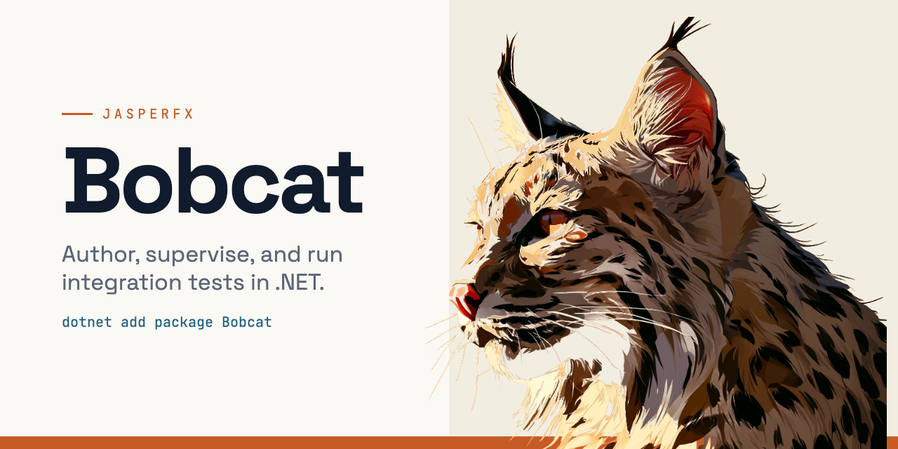
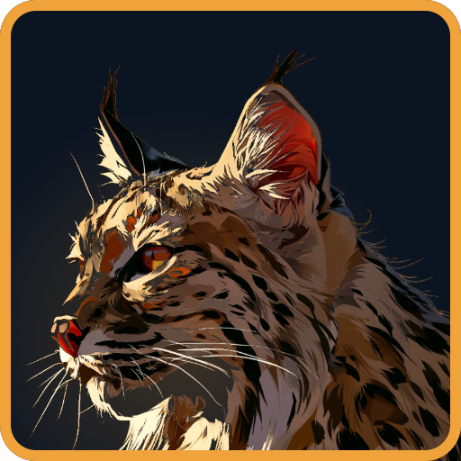

<p align="center">
  <picture>
    <source media="(prefers-color-scheme: dark)" srcset="docs/public/bobcat-social-dark-1280x640.png">
    <source media="(prefers-color-scheme: light)" srcset="docs/public/bobcat-social-light-1280x640.png">
    
  </picture>
</p>

<h1 align="center">Bobcat</h1>

<p align="center">
  A toolset for authoring, supervising, and executing integration tests in .NET.
</p>

## Install

```bash
dotnet add package Bobcat
```

## Docs

The documentation site is VitePress-rooted at [`docs/`](docs) — the markdown below *is* the site:

```bash
npm install
npm run docs
```

- [Sample Wiring Playbook](docs/sample-wiring.md) — how to wire a sample host to `BobcatRunner`
  so its `.feature` specs run end-to-end through Alba, plus the known wiring footguns and fixes.
- [Version Matrix](docs/versions.md) — the canonical, mutually-compatible dependency set
  (WolverineFx / Marten / JasperFx / Alba / TFM) that Bobcat and its samples align on.
- [Editor Integration](docs/editor-integration.md) — step completion and go-to-definition for
  `.feature` files: VS Code works today with the official Cucumber extension and the committed
  `.vscode/settings.json`; Rider needs an upstream `Reqnroll.Rider` change (proposal inside).

## Brand

Project graphics and the "Ember on Ink" color tokens live in [`docs/public/`](site/public)
and `bobcat-theme.css`.

<p align="center">
  
</p>
