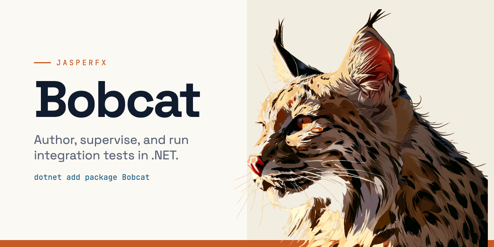
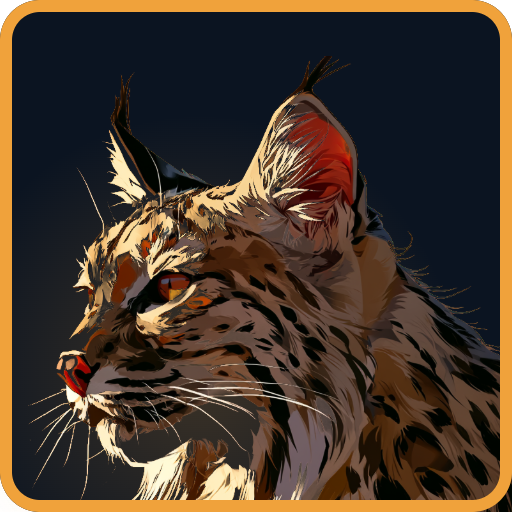

<p align="center">
  <picture>
    <source media="(prefers-color-scheme: dark)" srcset="docs/public/bobcat-social-dark-1280x640.png">
    <source media="(prefers-color-scheme: light)" srcset="docs/public/bobcat-social-light-1280x640.png">
    
  </picture>
</p>

# Bobcat

## Author, Supervise, and Run Integration Tests in .NET

[](https://discord.gg/WMxrvegf8H)
[](https://github.com/JasperFx/bobcat/actions/workflows/tests.yml)
[](https://github.com/JasperFx/bobcat/actions/workflows/samples.yml)
[](https://www.nuget.org/packages/Bobcat/)
[](https://www.nuget.org/packages/Bobcat/)

Bobcat is a spec-driven integration testing framework for .NET and the successor to
[Storyteller](https://storyteller.github.io). It is built for the hardest integration testing jobs:
systems with databases, message brokers, background processing, and many moving parts.

- **Author** specifications in Gherkin, bound to your own test code. A Roslyn source generator
  compiles each `.feature` file into direct method calls, so there is no runtime reflection and a
  step that matches nothing is a compile error, not a runtime surprise. Or keep writing tests in
  xUnit.net or TUnit, and let Bobcat render them as readable specifications.
- **Supervise** a large suite so its results can be trusted. It can split the suite across worker
  processes, isolate resources per lane, retry within budgets, and report flakiness honestly
  instead of burying it.
- **Specify** end to end. Executable specifications still read as requirements, and they can be
  scaffolded slice by slice from an Event Model. Bobcat has first-class support for the Critter
  Stack ([Wolverine](https://wolverinefx.net), [Marten](https://martendb.io), Polecat and Fisher)
  and for [Alba](https://jasperfx.github.io/alba/).

Bobcat runs as a [Microsoft.Testing.Platform](https://learn.microsoft.com/dotnet/core/testing/microsoft-testing-platform-intro)
test host, so scenarios show up in `dotnet test`, your IDE's Test Explorer, and CI like any other
test.

Access the docs [here](https://bobcat.jasperfx.net). For any of your questions, including about
the rest of the Critter Stack, join our [Discord channel](https://discord.gg/WMxrvegf8H). It is the
best way to reach us quickly. You can also raise questions or report problems through
[GitHub Issues](https://github.com/JasperFx/bobcat/issues).

## Support Plans

<div align="center">
    
</div>

While Bobcat is open source, [JasperFx Software offers paid support and consulting contracts](https://jasperfx.net/support-plans/) for Bobcat.

## Help us keep working on this project 💚

[Become a Sponsor on GitHub](https://github.com/sponsors/JasperFX) by sponsoring monthly or one time.

## Packages

| Package | What it is for |
|---------|----------------|
| [`Bobcat`](https://www.nuget.org/packages/Bobcat/) | The runtime: spec engine, resources, rendering, the runner, and the store-agnostic Critter Stack grammar |
| [`Bobcat.Generators`](https://www.nuget.org/packages/Bobcat.Generators/) | The source generator that compiles `.feature` files into direct fixture method calls |
| [`Bobcat.Mtp`](https://www.nuget.org/packages/Bobcat.Mtp/) | Runs Bobcat specs as a Microsoft.Testing.Platform test host (`dotnet test`, Test Explorer) |
| [`Bobcat.Supervisor`](https://www.nuget.org/packages/Bobcat.Supervisor/) | Drives any MTP test host as worker processes, with retry, isolation, and parallel lanes |
| [`Bobcat.Alba`](https://www.nuget.org/packages/Bobcat.Alba/) | An ASP.NET Core application hosted in memory as a test resource |
| [`Bobcat.Wolverine`](https://www.nuget.org/packages/Bobcat.Wolverine/) | Dispatches through Wolverine's tracked session, so assertions run after everything a message caused |
| [`Bobcat.EntityFrameworkCore`](https://www.nuget.org/packages/Bobcat.EntityFrameworkCore/) | The `[EfCoreEntities]` persistence recipe for data-setup tables |
| [`Bobcat.Xunit`](https://www.nuget.org/packages/Bobcat.Xunit/) / [`Bobcat.TUnit`](https://www.nuget.org/packages/Bobcat.TUnit/) | Renders an existing xUnit.net v3 or TUnit suite as specifications, without changing how it runs |
| [`Bobcat.EventModel`](https://www.nuget.org/packages/Bobcat.EventModel/) / [`Bobcat.EventModel.Scaffolding`](https://www.nuget.org/packages/Bobcat.EventModel.Scaffolding/) | Curated Event Model files, and scaffolding slices from them |
| [`Bobcat.Console`](https://www.nuget.org/packages/Bobcat.Console/) | The `bobcat` global tool: reads, validates, and converts Event Model files |

```bash
dotnet add package Bobcat
```

See [Getting Started](https://bobcat.jasperfx.net/getting-started) for wiring up a first spec project.

## Working with the Code

Before getting started you will need the following in your environment:

### 1. .NET SDK 10.0+

Available [here](https://dotnet.microsoft.com/download). The repository builds with the .NET 10 SDK. Most
packages target both net9.0 and net10.0; `Bobcat.Generators` targets `netstandard2.0` because it
is a Roslyn analyzer.

### 2. Docker

Some integration tests and every sample need a real PostgreSQL database. The fastest way to get one
is the `docker-compose.yml` at the repository root, which also starts a RabbitMQ broker:

```bash
docker compose up -d
```

or, through the build (see below), `./build.sh Docker`. The services are published on ports that
will not collide with ones you may already run: Postgres on **5445** and RabbitMQ on **5683**
(management UI on 15683).

To use your own database instead, set `BOBCAT_POSTGRES` to its connection string. Without a
database, the tests that need one **skip locally** and say so. On CI they never skip, so a missing
database fails the build instead of passing silently.

### 3. Node.js (only for the documentation)

A current LTS release (the docs workflow uses Node 24), to run the VitePress documentation site
locally. See [Documentation](#documentation).

### The Solution

`bobcat.slnx` at the repository root is the solution for everything under `src/`. It is the only
solution file at the root, so `dotnet build` and `dotnet test` pick it up without being told.

- **`src/`** contains the packages, their test projects, and a few sample hosts the tests drive.
- **`samples/`** contains complete sample applications, each with its own `.slnx` and a `Tests/`
  spec project. They are deliberately **not** in `bobcat.slnx`. They reference Bobcat by project
  reference, so they always build against the code in your checkout.
- **`spikes/`** contains throwaway research code, kept for reproducibility, with its own solution.
- **`build/`** is the Nuke build project described below.
- **`docs/`** is the documentation site.

Package versions are managed centrally with NuGet's
[Central Package Management](https://learn.microsoft.com/nuget/consume-packages/central-package-management):
`src/Directory.Packages.props` and `samples/Directory.Packages.props` hold every version, and a
`PackageReference` never carries its own `Version`. The Critter Stack versions in those two files
must stay identical. The header comment in `src/Directory.Packages.props` explains why.

### Tooling

* Tests use [xUnit.net v3](https://xunit.net), [Shouldly](https://github.com/shouldly/shouldly), and
  [NSubstitute](https://nsubstitute.github.io), and run on **Microsoft.Testing.Platform** rather
  than VSTest. Every test project is a self-executing test host.
* [Nuke](https://nuke.build) is used for build automation.
* [VitePress](https://vitepress.dev) builds the documentation site.

### Build Commands

The Nuke build is the single definition of what CI does. Every GitHub Actions workflow calls it, so
a green `./build.sh CI` on your machine means the same thing as a green push.

| Description | Windows Commandline | PowerShell | Linux / macOS Shell | DotNet CLI |
|-------------|---------------------|------------|---------------------|------------|
| Restore, build and test (the default) | `build.cmd` | `build.ps1` | `./build.sh` | `dotnet run --project build/Build.csproj` |
| Start the Docker services | `build.cmd docker` | `build.ps1 docker` | `./build.sh docker` | `dotnet run --project build/Build.csproj -- docker` |
| Everything the `tests` workflow runs | `build.cmd ci` | `build.ps1 ci` | `./build.sh ci` | `dotnet run --project build/Build.csproj -- ci` |
| Pack every package to `artifacts/packages` | `build.cmd pack` | `build.ps1 pack` | `./build.sh pack` | `dotnet run --project build/Build.csproj -- pack` |
| Build every sample and run its specs | `build.cmd samples` | `build.ps1 samples` | `./build.sh samples` | `dotnet run --project build/Build.csproj -- samples` |
| List every target and parameter | `build.cmd --help` | `build.ps1 --help` | `./build.sh --help` | `dotnet run --project build/Build.csproj -- --help` |

Targets combine, so `./build.sh docker ci` starts the services and then runs the full CI build.
The build uses the Debug configuration locally and Release on a CI server. Override it with
`--configuration Release`.

You can also work with the solution directly using the dotnet CLI:

```bash
dotnet build
dotnet test

# Tests run on Microsoft.Testing.Platform, so filters go to the test host after `--`
dotnet test src/Bobcat.Tests/ -- --filter-class "*PipelineTests"
```

> Note: have the Docker services running (`./build.sh docker`) before running the tests or the
> samples, or the database-backed tests will skip.

### Continuous Integration

CI is GitHub Actions only, and each workflow is a thin wrapper around the Nuke build:

| Workflow | Runs | When |
|----------|------|------|
| `tests.yml` | `./build.sh CI`, with Postgres and RabbitMQ services | every push |
| `samples.yml` | `./build.sh Samples`, with a Postgres service | pushes touching `src/`, `samples/`, or `build/` |
| `publish.yml` | `./build.sh CI Pack`, then pushes to nuget.org | `v*` tags, or manually |
| `docs.yml` | builds and deploys the documentation site | manually |

To change what CI does, change `build/Build.cs` or `build/Samples.cs`, not the workflows.

## Documentation

All the documentation is written in Markdown in the [`docs/`](docs) directory and published as a
static site at [bobcat.jasperfx.net](https://bobcat.jasperfx.net) using
[VitePress](https://vitepress.dev). The Markdown in `docs/` *is* the site. Navigation and sidebars
are defined in `docs/.vitepress/config.mjs`.

To run the docs locally, with auto-refresh on any changes:

```bash
npm install
npm run docs
```

To check a production build before publishing:

```bash
npm run docs:build     # builds to docs/.vitepress/dist
npm run docs:preview   # serves that build locally
```

The site is deployed by running the `docs.yml` workflow manually from the Actions tab. Nothing
deploys the documentation automatically on push.

## Brand

Project graphics and the "Ember on Ink" color tokens live in [`docs/public/`](docs/public)
and `docs/.vitepress/theme/style.css`.

## License

Copyright © Jeremy D. Miller and contributors.

Bobcat is provided as-is under the MIT license. For more information see [LICENSE](LICENSE).

## Code of Conduct

This project has adopted the code of conduct defined by the [Contributor Covenant](http://contributor-covenant.org/) to clarify expected behavior in our community.

<p align="center">
  
</p>
